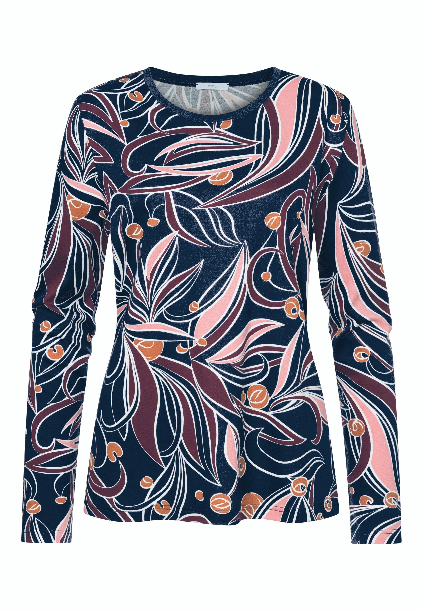
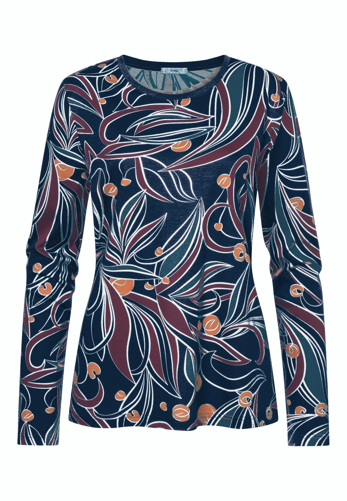

# Target_Color_Swap

python testswap.py --image input-image-path --output output-directory-to-save --target_rgb 37 88 128

## Other Arguments
   --mink: default is 2. Minimum cluster
   --maxk: default is 7. Maximum Cluster
   --shades_range: default is 5. Finds 5 next nearest shades(dark) to replace.
   --tint_range: default is 5. Finds 5 next nearest tint(light) to replace.
    

    
    

  - Required library : PIL, Python, matplotlib, cv2, numpy, pandas, sklearn
